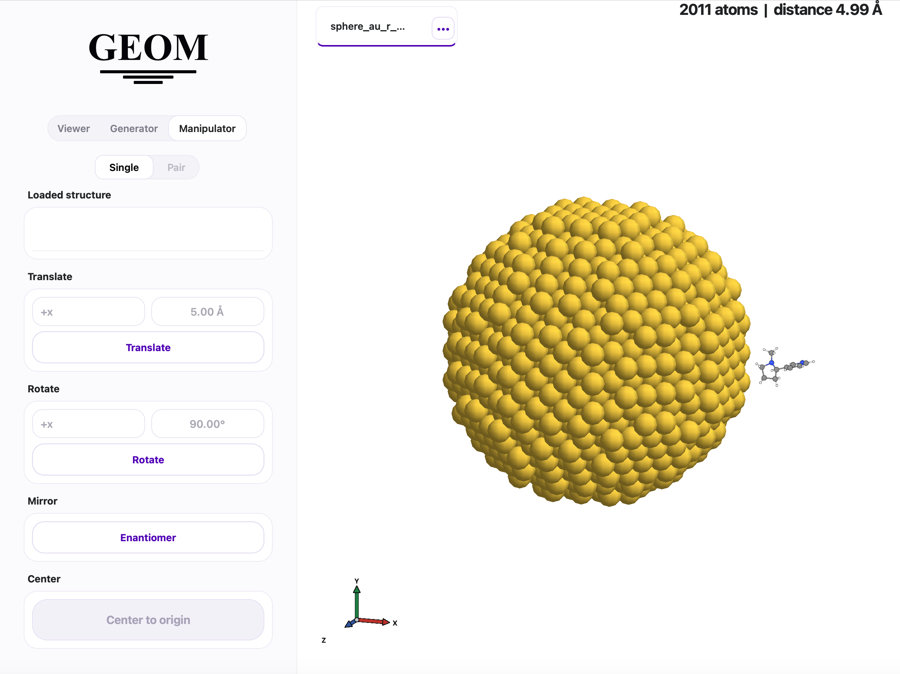

GEOM Structure Studio
---------------------

**GEOM Structure Studio** is a native desktop GUI for interactive nanoparticle and graphene creation,
3D visualization, and structure manipulation.

Launching the App
~~~~~~~~~~~~~~~~~

**From the terminal** — load the environment with ``geom_load``, then run:

.. code-block:: bash

   geomapp

**macOS** — the installer creates a native ``.app`` bundle at ``~/Applications/GEOM.app``.
Open it directly from Finder or Spotlight.

**Linux / WSL** — the installer registers a ``.desktop`` entry at
``~/.local/share/applications/geom.desktop``. Open GEOM from your application launcher.

Generator
~~~~~~~~~

Create nanoparticles and graphene structures with interactive parameter controls.

Supported nanoparticle shapes:

- Sphere, Rod, Tip, Pyramid, Cone, Microscope
- Icosahedron, Cuboctahedron, Decahedron

Supported graphene shapes:

- Disk, Ribbon, Ring, Triangle

Optional configurations: alloy, dimer, bowtie, core-shell.

Viewer
~~~~~~

Load structures via the file picker or drag-and-drop (XYZ, PDB, SMILES).
Multiple structures open in separate tabs.

Controls:

- **Sphere size**, **bond width**, and **resolution** sliders.
- **Atom selection** — VMD-like coordinate expressions, e.g. ``x > 0 and name C``.
- **Rotate** — drag. **Pan** — Shift+drag. **Zoom** — scroll.
- **Reset view** — ``Shift+0``.

Manipulator
~~~~~~~~~~~

Operate on any loaded structure using the source selector.

- **Translate** — move along any axis by a given distance.
- **Rotate** — rotate around any axis by a given angle.
- **Mirror** — generate the enantiomer (mirror + center).
- **Center** — translate center of mass to the origin.
- **Pair / Controlled distance** — place two structures at a precise surface-to-surface distance along any axis.
