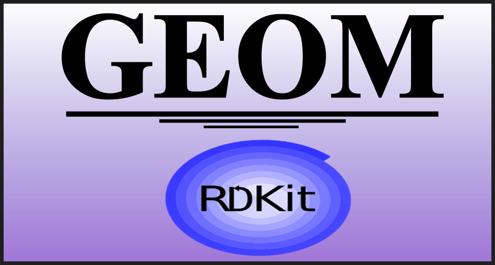

Welcome to GEOM's documentation!
===============================

**GEOM** is a tool for creating, modifying, and analyzing XYZ geometry files. It provides **geometry transformations, nanoparticle generation, and graphene structure creation** for computational research, with both a command-line interface and a native desktop GUI.

.. toctree::
   :maxdepth: 1
   :caption: Table of Contents

   features
   installation
   activate_env
   usage
   example
   gui
   ai_assistant
   code  # Updated from "API Reference" to "Code"
   tests
   license
   contact

