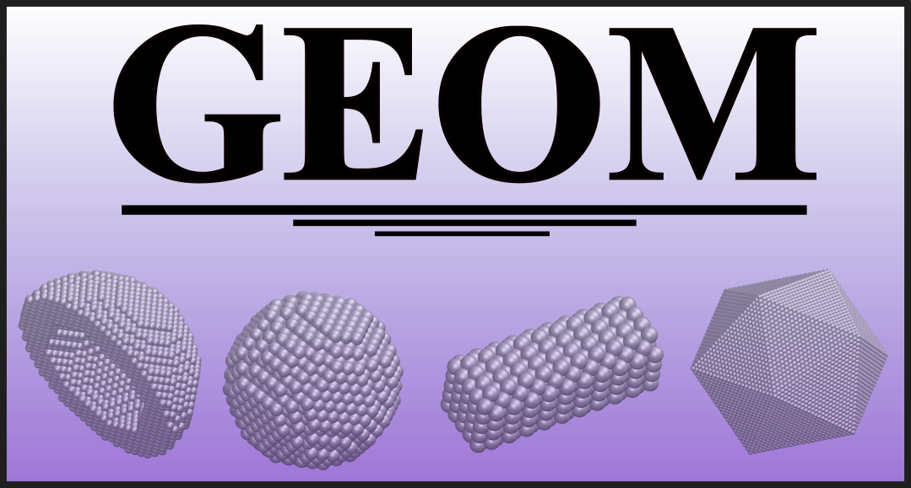

.. toctree::
   :maxdepth: 2
   :caption: Table of Contents

   installation  
   usage         
   api_reference 



Welcome to GEOM's documentation!
===============================

**GEOM** is a command-line tool for creating, modifying, and analyzing XYZ geometry files. It provides **geometry transformations, nanoparticle generation, and graphene structure creation** for computational research.

Features
--------

- **Geometry Transformations**: Translation, rotation, merging, and specular (mirror) transformations.
- **Nanoparticle Generation**: Sphere, rod, core-shell, tip, pyramid, cone, icosahedron, and more.
- **Graphene Structures**: Ribbons, disks, rings, and triangles.
- **Advanced Options**: Alloying, dimer formation, and bowtie configurations.
- **Minimum Distance Calculation** between XYZ geometries.
- **Geometrical Center Computation**.

Installation
------------

GEOM requires **Python 3.6+** and the following dependencies:

- gmsh==4.11.1
- ase==3.22.1
- numpy==1.24.3
- pytest==8.3.4
- launchpadlib==2.1.0

To set up your environment, run the following script:

```
./install.sh
```

This script will:
- Check if **Miniconda** or **Anaconda** is installed. If not, it will prompt you to install Miniconda.
- Set up a Conda virtual environment named **geom_env** with the necessary dependencies.
- Configure environment variables and aliases for running **GEOM**.

Activate the Environment
-------------------------

After running the install.sh script, you need to load the GEOM environment:

```
geom_load
```

This will activate the **Conda environment**, set up the necessary aliases, and configure the environment variables needed to run **GEOM**.

Usage
-----

Once the environment is set up, you can run the following command to see all available options:

```
geom -h
```

This will display the help menu with all the available commands and their descriptions.

Example commands:
------------------

- **Rotate geometry 90 degrees** around the Y-axis:

```
geom -r1 90 geom.xyz origin_CM_yes +y
```

- **Generate a nanoparticle sphere**:

```
geom -create -sphere Ag 30
```

- **Generate a graphene ribbon**:

```
geom -create -graphene rib 50 20
```


.. toctree::
   :maxdepth: 2
   :caption: Code Structure

   autoapi/index

Running Tests
-------------

The ```install.sh``` script automatically runs tests to ensure everything is set up correctly.

To manually rerun the tests:

```
./geom/tests/run_all_tests.sh
```

This will re-run all tests and confirm that your environment is set up correctly.

License
-------

GEOM is licensed under the **GNU General Public License v3.0**.

Contact
-------

For issues or contributions:

- Email: **pgrobasillobre@gmail.com**
- Github issues: https://github.com/pgrobasillobre/geom/issues

